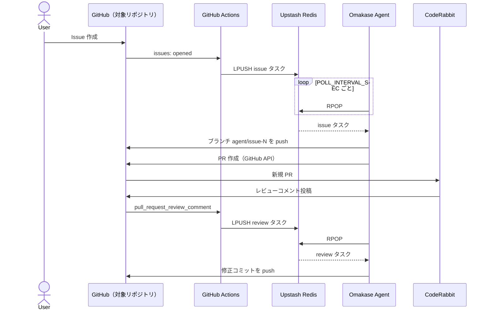

# Omakase の使い方

このガイドでは、Omakase のローカルデプロイと対象リポジトリ側の GitHub 設定を含む、エンドツーエンドのセットアップ手順を説明します。

> アーキテクチャの概要は [README.ja.md](./README.ja.md) を参照してください。  
> English version: [HOW_TO_USE.md](./HOW_TO_USE.md)

---

## 1. Omakase が GitHub イベントを受け取る仕組み — 最初にお読みください

Omakase は **Webhook サーバーを持ちません**。設定可能な間隔で [Upstash Redis](https://upstash.com/) をポーリングするだけで、インバウンドのネットワーク要件はありません。

GitHub イベントは、*対象リポジトリ*（Issue を実装させたいリポジトリ）にある **GitHub Actions ワークフロー** (`trigger-agent.yml`) によって中継されます。新しい Issue が作成されたとき、またはエージェントが作成した PR に CodeRabbit がレビューコメントを投稿したとき、このワークフローが JSON タスクペイロードを Redis の `agent-queue` リストに push します。



---

## 2. 前提条件

### アカウント

| アカウント | 用途 |
| --- | --- |
| [Anthropic](https://www.anthropic.com/) | LLM 推論用 `ANTHROPIC_API_KEY` |
| [Upstash](https://upstash.com/) | 無料枠 Redis（HTTP REST エンドポイント + Bearer Token） |
| GitHub | Issue のソースおよび PR のターゲット |

### ローカルツール

| ツール | 用途 |
| --- | --- |
| Docker | kind の実行に必要 |
| [kind](https://kind.sigs.k8s.io/) | ローカル Kubernetes クラスタ |
| [kubectl](https://kubernetes.io/docs/tasks/tools/) | Kubernetes CLI |
| [task](https://taskfile.dev/) | `Taskfile.yml` を実行（`go install github.com/go-task/task/v3/cmd/task@latest`） |
| [tk](https://tanka.dev/) | Tanka — jsonnet でエージェントをデプロイ（`go install github.com/grafana/tanka/cmd/tk@latest`） |
| [jb](https://github.com/jsonnet-bundler/jsonnet-bundler) | Jsonnet バンドラー（Tanka に必要。`go install github.com/jsonnet-bundler/jsonnet-bundler/cmd/jb@latest`） |

> **ヒント:** [mise](https://mise.jdx.dev/) を使うと、このリポジトリの `mise.toml` からすべてのツールバージョンを一括管理できます。

---

## 3. API 認証情報の取得

### 3.1 Anthropic API キー

[console.anthropic.com](https://console.anthropic.com/) にサインインして API キーを作成し、`ANTHROPIC_API_KEY` として記録します。

### 3.2 Upstash Redis

1. [upstash.com](https://upstash.com/) でサインアップし、新しい Redis データベースを作成します。
2. データベースコンソールから以下をコピーします。
   - **Endpoint** → `UPSTASH_REDIS_URL`（形式: `https://<id>.upstash.io`）
   - **Password**（REST トークン）→ `UPSTASH_REDIS_TOKEN`

無料枠（10,000 コマンド/日、256 MB）は個人利用に十分です。

### 3.3 GitHub Personal Access Token

対象リポジトリを対象にした **fine-grained PAT** を作成し、次の権限を付与してください。

| 権限 | アクセス | 用途 |
| --- | --- | --- |
| Contents | 読み書き | `git clone`、`git push` |
| Pull requests | 読み書き | PR 作成 |
| Issues | 読み書き | 中断コメントの投稿 |
| Metadata | 読み取り | 常に必要 |

クラシック PAT の場合は `repo` スコープ（パブリックリポジトリのみなら `public_repo`）で代用できます。

> `GITHUB_TOKEN` は Omakase エージェント本体（ローカル kind クラスタ）が使用します。`trigger-agent.yml` 内の `${{ secrets.GITHUB_TOKEN }}` は GitHub Actions 組み込みのトークンであり、手動での設定は不要です。

---

## 4. ローカル Omakase のセットアップ

### 4.1 このリポジトリをテンプレートとして使う

GitHub の **Use this template** ボタンから自分のコピーを作成するか、リポジトリをフォークします。  
ローカルにクローンします。

```sh
git clone https://github.com/<your-org>/omakase.git
cd omakase
```

### 4.2 `.env` を作成する

リポジトリルートに `.env` ファイルを作成します（gitignore 済み）。

```env
# 必須
ANTHROPIC_API_KEY=sk-ant-...
UPSTASH_REDIS_URL=https://<id>.upstash.io
UPSTASH_REDIS_TOKEN=<token>
GITHUB_TOKEN=github_pat_...
SANDBOX_TEMPLATE=coding-agent-sandbox

# 任意（デフォルト値を示す）
SANDBOX_NAMESPACE=default
POLL_INTERVAL_SEC=30
MAX_ITERATION=5
```

`task secret:create`（`task deploy` の一部として実行）がこのファイルを読み込み、`omakase` namespace に `omakase` という名前の Kubernetes Secret を作成します。

> リポジトリをフォークして独自の Docker イメージを push した場合は、`k8s/environments/default/config.libsonnet` の `image` フィールドをそのイメージに変更してください。デフォルトイメージは `ghcr.io/khirotaka/omakase:latest` です。

### 4.3 kind クラスタを構築する

```sh
task cluster:setup
```

このコマンド 1 つで以下を実行します。

1. `kind-config.yaml` を使って `omakase` という kind クラスタを作成。
2. `omakase` Kubernetes namespace を作成。
3. `kubernetes-sigs/agent-sandbox` v0.4.5 の CRD とコントローラーをインストール。
4. `SandboxTemplate`（`k8s/sandbox/template.yaml`）を適用。これが `coding-agent-sandbox` Pod テンプレートを定義します。

### 4.4 エージェントをデプロイする

```sh
task deploy
```

このコマンドは以下を実行します。

1. `.env` から `omakase` Kubernetes Secret を作成（または更新）。
2. `tk apply environments/default` を実行して `omakase` Deployment を `omakase` namespace にデプロイ。

### 4.5 デプロイを確認する

```sh
kubectl -n omakase get pods
kubectl -n omakase logs deploy/omakase -f
```

正常に起動すると、次のようなログが表示されます。

```
time=... level=INFO msg="queue empty, waiting..."
```

---

## 5. 対象リポジトリの設定（GitHub 側）

このセクションでは、GitHub 側の設定 — Omakase ドキュメントで「Webhook 設定」と呼ぶもの — を行います。エージェントはポーリング型のため、Webhook サーバーの運用は不要です。代わりに、対象リポジトリの GitHub Actions がイベントを Upstash Redis に転送するよう設定します。

### 5.1 トリガーワークフローを追加する

このリポジトリの `.github/workflows/trigger-agent.yml` を、対象リポジトリの同じパス（`.github/workflows/trigger-agent.yml`）にコピーします。

ワークフローは 2 つの GitHub イベントを購読します。

| イベント | フィルター | 結果 |
| --- | --- | --- |
| `issues: [opened]` | なし — すべての新規 Issue | `issue` タスクを Redis に push |
| `pull_request_review_comment: [created]` | `comment.user.login == 'coderabbitai[bot]'` かつブランチが `agent/issue-{N}` にマッチ | `review` タスクを Redis に push |

参考用のワークフロー全文：

```yaml
name: Trigger Agent

on:
  issues:
    types: [opened]
  pull_request_review_comment:
    types: [created]

jobs:
  enqueue:
    runs-on: ubuntu-latest
    steps:
      - name: Enqueue issue task
        if: github.event_name == 'issues'
        env:
          UPSTASH_REDIS_URL: ${{ secrets.UPSTASH_REDIS_URL }}
          UPSTASH_REDIS_TOKEN: ${{ secrets.UPSTASH_REDIS_TOKEN }}
          ISSUE_NUMBER: ${{ github.event.issue.number }}
          REPO_OWNER: ${{ github.repository_owner }}
          REPO_NAME: ${{ github.event.repository.name }}
          ISSUE_BODY: ${{ github.event.issue.body }}
        run: |
          TASK=$(jq -cn \
            --arg type "issue" \
            --argjson issueNumber "$ISSUE_NUMBER" \
            --arg repoOwner "$REPO_OWNER" \
            --arg repoName "$REPO_NAME" \
            --arg body "$ISSUE_BODY" \
            '{type: $type, issueNumber: $issueNumber, repoOwner: $repoOwner, repoName: $repoName, body: $body}')
          curl -sf -X POST "${UPSTASH_REDIS_URL}/lpush/agent-queue" \
            -H "Authorization: Bearer ${UPSTASH_REDIS_TOKEN}" \
            -H "Content-Type: application/json" \
            -d "$(jq -cn --arg v "$TASK" '[$v]')"

      - name: Enqueue review task
        if: github.event_name == 'pull_request_review_comment' && github.event.comment.user.login == 'coderabbitai[bot]'
        env:
          UPSTASH_REDIS_URL: ${{ secrets.UPSTASH_REDIS_URL }}
          UPSTASH_REDIS_TOKEN: ${{ secrets.UPSTASH_REDIS_TOKEN }}
          BRANCH: ${{ github.event.pull_request.head.ref }}
          REPO_OWNER: ${{ github.repository_owner }}
          REPO_NAME: ${{ github.event.repository.name }}
          COMMENT_BODY: ${{ github.event.comment.body }}
        run: |
          ISSUE_NUMBER=$(echo "$BRANCH" | grep -oP '(?<=agent/issue-)\d+' || true)
          if [ -z "$ISSUE_NUMBER" ]; then
            echo "Branch '$BRANCH' does not match agent/issue-{N} pattern, skipping"
            exit 0
          fi
          TASK=$(jq -cn \
            --arg type "review" \
            --argjson issueNumber "$ISSUE_NUMBER" \
            --arg repoOwner "$REPO_OWNER" \
            --arg repoName "$REPO_NAME" \
            --arg body "$COMMENT_BODY" \
            '{type: $type, issueNumber: $issueNumber, repoOwner: $repoOwner, repoName: $repoName, body: $body}')
          curl -sf -X POST "${UPSTASH_REDIS_URL}/lpush/agent-queue" \
            -H "Authorization: Bearer ${UPSTASH_REDIS_TOKEN}" \
            -H "Content-Type: application/json" \
            -d "$(jq -cn --arg v "$TASK" '[$v]')"
```

### 5.2 対象リポジトリに Actions Secrets を登録する

対象リポジトリの **Settings → Secrets and variables → Actions → New repository secret** から以下を追加します。

| シークレット名 | 値 |
| --- | --- |
| `UPSTASH_REDIS_URL` | Upstash REST エンドポイント |
| `UPSTASH_REDIS_TOKEN` | Upstash Bearer Token |

これらはローカルの `.env` に記入したものと同じ値です。

### 5.3 CodeRabbit GitHub App をインストールする

1. [coderabbit.ai](https://coderabbit.ai/) にアクセスし、**Add to GitHub** をクリック。
2. 対象リポジトリ（または Organization）を選択。
3. CodeRabbit はパブリック（OSS）リポジトリに対して無料で利用できます。

インストール後、CodeRabbit はすべての PR を自動レビューしてインラインコメントを投稿します。`trigger-agent.yml` が `coderabbitai[bot]` のコメントを検知し、修正タスクをエンキューします。

---

## 6. エンドツーエンドで動かす

1. 対象リポジトリに **Issue を作成**します。実装してほしい機能や変更を明確に記述してください — LLM がその内容をそのまま使います。
2. `trigger-agent.yml` ワークフローが自動で起動し、`issue` タスクを Redis に push します。
3. `POLL_INTERVAL_SEC` 秒以内（デフォルト: 30 秒）にエージェントがタスクを取得します。
4. エージェントはブランチ `agent/issue-{N}` を作成し、サンドボックス内でコードを実装して、`feat: implement issue #N` というタイトルの PR を作成します。PR 本文には `Closes #N` が含まれます。
5. CodeRabbit が PR をレビューし、インラインコメントを投稿します。
6. `coderabbitai[bot]` のコメントごとに新しい review タスクがキューに入ります。エージェントは修正コミット（`fix: apply review feedback (iteration N)`）を push します。
7. `MAX_ITERATION` 回のレビューサイクルを使い果たした場合、またはリカバリー不能なエラーが発生した場合（例: `go test` 失敗）、エージェントは Issue にコメントを投稿します。

   > Agent aborted: reached maximum iteration limit (N). Please review and continue manually.

   PR は人間によるレビューとマージのためにオープンのまま残ります。

---

## 7. 運用

### 7.1 エージェントのログを確認する

```sh
kubectl -n omakase logs deploy/omakase -f
```

### 7.2 コードや設定変更後の再デプロイ

Docker イメージをリビルドして push（`release.yml` がタグ push 時に自動実行）した後：

```sh
kubectl -n omakase rollout restart deploy/omakase
```

`.env` を変更した後に Kubernetes Secret を更新するには：

```sh
task secret:create   # 冪等 — --dry-run + kubectl apply で適用
task deploy          # secret:create → tk apply を順番に実行
```

### 7.3 認証情報のローテーション

`.env` を更新して `task secret:create` を実行します。Pod は次回再起動時に新しい Secret を読み込みます。

### 7.4 クラスタを削除する

```sh
task cluster:delete
```

kind クラスタ全体が削除されます。クラスタ内のすべてのサンドボックス Pod、セッション、Secret が破棄されます。Upstash Redis のデータは残ります。

---

## 8. トラブルシューティング

| 症状 | 考えられる原因 | 対処方法 |
| --- | --- | --- |
| ログに `"session already exists"` | その Issue 番号の Redis セッションが生存中（TTL: 24 時間） | TTL の期限切れを待つ、または `curl -X DELETE ${UPSTASH_REDIS_URL}/del/session:{N} -H "Authorization: Bearer ${UPSTASH_REDIS_TOKEN}"` でキーを削除 |
| エージェントがタスクを取得しない | Upstash の URL またはトークンが不正 | `kubectl -n omakase logs deploy/omakase` で HTTP エラーを確認し、`.env` の値を検証 |
| PR push が 403 で失敗 | GitHub PAT のスコープ不足 | Contents（読み書き）と Pull requests（読み書き）権限を確認（§3.3 参照） |
| CodeRabbit コメントで修正がトリガーされない | App が未インストール、またはブランチ名が `agent/issue-{N}` 形式でない | 対象リポジトリへの CodeRabbit インストールを確認；PR のヘッドブランチが正確に `agent/issue-{N}` であることを確認 |
| `agent-sandbox` Pod が起動しない | CRD が未インストール | `task cluster:install-agent-sandbox` と `task cluster:apply-sandbox-template` を実行；`kubectl describe sandboxtemplate coding-agent-sandbox` で状態を確認 |
| サンドボックス内で `go test` が失敗する | 生成されたコードにバグがある | エージェントは自動リトライしない；詳細な説明で新しい Issue を作成するか、PR を手動で修正 |

---

## 9. 既知の制限事項

以下は現在の実装の制限です。将来のバージョンで改善される可能性があります。

- **Issue あたり 1 つの Go ファイル。** LLM プロンプトはタスクごとに 1 つの Go ソースファイルのみを生成します。複数ファイルにまたがる実装は現時点では非対応です。
- **ベースブランチが `main` にハードコードされています。** エージェントは常に `main` をターゲットにして PR を作成します。デフォルトブランチ名が異なるリポジトリはサポートされません。
- **セッションあたり 1 回の修正ループ。** `MAX_ITERATION` のデフォルトは 5 ですが、修正に成功するとセッションは `done` に遷移します。同じ PR に対するその後の CodeRabbit コメントは、手動でセッションをリセットしない限り処理されません。
- **修正をトリガーするのは CodeRabbit のレビューコメントのみ。** エージェントは `coderabbitai[bot]` による `pull_request_review_comment` イベントにのみ反応します。人間のレビューコメントや通常の PR コメントは設計上無視されます。
- **自動マージなし。** エージェントは PR をマージしません。満足できたら人間（または別の自動化）がマージする必要があります。

---

## 10. 環境変数リファレンス

| 変数名 | 必須 | デフォルト | 説明 |
| --- | --- | --- | --- |
| `ANTHROPIC_API_KEY` | はい | — | Anthropic API キー |
| `UPSTASH_REDIS_URL` | はい | — | Upstash REST エンドポイント（`https://xxx.upstash.io`） |
| `UPSTASH_REDIS_TOKEN` | はい | — | Upstash REST Bearer Token |
| `GITHUB_TOKEN` | はい | — | GitHub PAT（Contents + PR + Issues 読み書き） |
| `SANDBOX_TEMPLATE` | はい | — | `SandboxTemplate` リソース名（デフォルト構成: `coding-agent-sandbox`） |
| `SANDBOX_NAMESPACE` | いいえ | `default` | サンドボックス Pod を起動する namespace |
| `POLL_INTERVAL_SEC` | いいえ | `30` | Redis ポーリング間隔（秒） |
| `MAX_ITERATION` | いいえ | `5` | CodeRabbit フィードバックの最大修正回数 |
