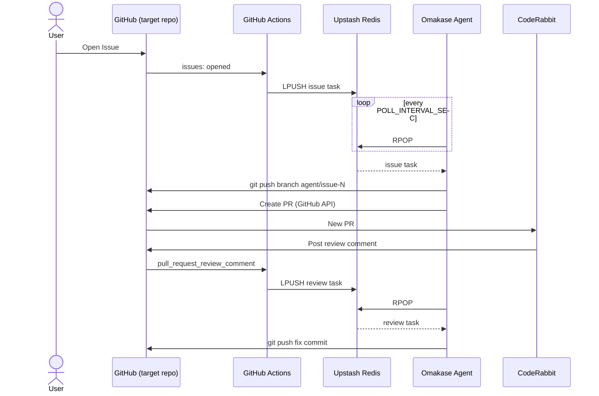

# How to Use Omakase

This guide walks through the complete end-to-end setup of an Omakase deployment and the GitHub-side configuration of a target repository.

> For an architecture overview, see [README.md](./README.md).  
> 日本語版は [HOW_TO_USE.ja.md](./HOW_TO_USE.ja.md) にあります。

---

## 1. How Omakase receives GitHub events — read this first

Omakase does **not** run a webhook server. It polls [Upstash Redis](https://upstash.com/) on a configurable interval and has no inbound network requirements.

GitHub events are delivered by a **GitHub Actions workflow** (`trigger-agent.yml`) that lives in the *target* repository — the one whose Issues you want the agent to implement. When a new Issue is opened, or when CodeRabbit posts a review comment on an agent-created PR, the workflow pushes a JSON task payload to the `agent-queue` Redis list.



---

## 2. Prerequisites

### Accounts

| Account | Purpose |
| --- | --- |
| [Anthropic](https://www.anthropic.com/) | `ANTHROPIC_API_KEY` for LLM inference |
| [Upstash](https://upstash.com/) | Free-tier Redis (HTTP REST endpoint + bearer token) |
| GitHub | Source of Issues and target for PRs |

### Local tools

| Tool | Purpose |
| --- | --- |
| Docker | Required by kind |
| [kind](https://kind.sigs.k8s.io/) | Local Kubernetes cluster |
| [kubectl](https://kubernetes.io/docs/tasks/tools/) | Kubernetes CLI |
| [task](https://taskfile.dev/) | Runs `Taskfile.yml` (`go install github.com/go-task/task/v3/cmd/task@latest`) |
| [tk](https://tanka.dev/) | Tanka — deploys the agent via jsonnet (`go install github.com/grafana/tanka/cmd/tk@latest`) |
| [jb](https://github.com/jsonnet-bundler/jsonnet-bundler) | Jsonnet bundler, required by Tanka (`go install github.com/jsonnet-bundler/jsonnet-bundler/cmd/jb@latest`) |

> **Tip:** [mise](https://mise.jdx.dev/) can manage all tool versions from `mise.toml` in this repo.

---

## 3. Get API credentials

### 3.1 Anthropic API key

Sign in to [console.anthropic.com](https://console.anthropic.com/), create an API key, and note it as `ANTHROPIC_API_KEY`.

### 3.2 Upstash Redis

1. Sign up at [upstash.com](https://upstash.com/) and create a new Redis database.
2. In the database console, copy:
   - **Endpoint** → `UPSTASH_REDIS_URL` (format: `https://<id>.upstash.io`)
   - **Password** (REST token) → `UPSTASH_REDIS_TOKEN`

The free tier (10,000 commands/day, 256 MB) is sufficient for personal use.

### 3.3 GitHub Personal Access Token

Create a **fine-grained PAT** scoped to the target repository with the following permissions:

| Permission | Access | Purpose |
| --- | --- | --- |
| Contents | Read & write | `git clone`, `git push` |
| Pull requests | Read & write | Create PRs |
| Issues | Read & write | Post abort comments |
| Metadata | Read | Always required |

For a classic PAT, the `repo` scope (or `public_repo` for public repos) covers all of the above.

> The `GITHUB_TOKEN` is used by the Omakase agent itself (local kind cluster). The built-in `${{ secrets.GITHUB_TOKEN }}` in GitHub Actions is used by `trigger-agent.yml` for read-only repo access and does not need to be configured manually.

---

## 4. Set up the local Omakase deployment

### 4.1 Use this repository as a template

Click **Use this template** on GitHub to create your own copy, or fork the repository.  
Clone it locally:

```sh
git clone https://github.com/<your-org>/omakase.git
cd omakase
```

### 4.2 Populate `.env`

Create a `.env` file at the repo root (it is gitignored):

```env
# Required
ANTHROPIC_API_KEY=sk-ant-...
UPSTASH_REDIS_URL=https://<id>.upstash.io
UPSTASH_REDIS_TOKEN=<token>
GITHUB_TOKEN=github_pat_...
SANDBOX_TEMPLATE=coding-agent-sandbox

# Optional (shown with defaults)
SANDBOX_NAMESPACE=default
POLL_INTERVAL_SEC=30
MAX_ITERATION=5
```

`task secret:create` (run as part of `task deploy`) reads this file and creates a Kubernetes Secret named `omakase` in the `omakase` namespace.

> If you fork the repo and push your own Docker image, update `image` in `k8s/environments/default/config.libsonnet` to point to it. The default image is `ghcr.io/khirotaka/omakase:latest`.

### 4.3 Build the kind cluster

```sh
task cluster:setup
```

This single command:
1. Creates a kind cluster named `omakase` using `kind-config.yaml`.
2. Creates the `omakase` Kubernetes namespace.
3. Installs `kubernetes-sigs/agent-sandbox` v0.4.5 CRDs and controllers.
4. Applies the `SandboxTemplate` (`k8s/sandbox/template.yaml`) that defines the `coding-agent-sandbox` pod template.

### 4.4 Deploy the agent

```sh
task deploy
```

This command:
1. Creates (or updates) the `omakase` Kubernetes Secret from `.env`.
2. Runs `tk apply environments/default` to deploy the `omakase` Deployment into the `omakase` namespace.

### 4.5 Verify the deployment

```sh
kubectl -n omakase get pods
kubectl -n omakase logs deploy/omakase -f
```

Once running, you should see log lines like:

```
time=... level=INFO msg="queue empty, waiting..."
```

---

## 5. Configure the target repository

This section covers the GitHub-side configuration — what the Omakase documentation calls "webhook setup." Because the agent is polling-based, there is no webhook server to operate. Instead, you configure GitHub Actions in the target repository to forward events to Upstash Redis.

### 5.1 Add the trigger workflow

Copy `.github/workflows/trigger-agent.yml` from this repository into the target repository at the same path (`.github/workflows/trigger-agent.yml`).

The workflow subscribes to two GitHub events:

| Event | Filter | Result |
| --- | --- | --- |
| `issues: [opened]` | none — all new issues | `issue` task pushed to Redis |
| `pull_request_review_comment: [created]` | `comment.user.login == 'coderabbitai[bot]'` and branch matches `agent/issue-{N}` | `review` task pushed to Redis |

Full workflow file for reference:

```yaml
name: Trigger Agent

on:
  issues:
    types: [opened]
  pull_request_review_comment:
    types: [created]

jobs:
  enqueue:
    runs-on: ubuntu-latest
    steps:
      - name: Enqueue issue task
        if: github.event_name == 'issues'
        env:
          UPSTASH_REDIS_URL: ${{ secrets.UPSTASH_REDIS_URL }}
          UPSTASH_REDIS_TOKEN: ${{ secrets.UPSTASH_REDIS_TOKEN }}
          ISSUE_NUMBER: ${{ github.event.issue.number }}
          REPO_OWNER: ${{ github.repository_owner }}
          REPO_NAME: ${{ github.event.repository.name }}
          ISSUE_BODY: ${{ github.event.issue.body }}
        run: |
          TASK=$(jq -cn \
            --arg type "issue" \
            --argjson issueNumber "$ISSUE_NUMBER" \
            --arg repoOwner "$REPO_OWNER" \
            --arg repoName "$REPO_NAME" \
            --arg body "$ISSUE_BODY" \
            '{type: $type, issueNumber: $issueNumber, repoOwner: $repoOwner, repoName: $repoName, body: $body}')
          curl -sf -X POST "${UPSTASH_REDIS_URL}/lpush/agent-queue" \
            -H "Authorization: Bearer ${UPSTASH_REDIS_TOKEN}" \
            -H "Content-Type: application/json" \
            -d "$(jq -cn --arg v "$TASK" '[$v]')"

      - name: Enqueue review task
        if: github.event_name == 'pull_request_review_comment' && github.event.comment.user.login == 'coderabbitai[bot]'
        env:
          UPSTASH_REDIS_URL: ${{ secrets.UPSTASH_REDIS_URL }}
          UPSTASH_REDIS_TOKEN: ${{ secrets.UPSTASH_REDIS_TOKEN }}
          BRANCH: ${{ github.event.pull_request.head.ref }}
          REPO_OWNER: ${{ github.repository_owner }}
          REPO_NAME: ${{ github.event.repository.name }}
          COMMENT_BODY: ${{ github.event.comment.body }}
        run: |
          ISSUE_NUMBER=$(echo "$BRANCH" | grep -oP '(?<=agent/issue-)\d+' || true)
          if [ -z "$ISSUE_NUMBER" ]; then
            echo "Branch '$BRANCH' does not match agent/issue-{N} pattern, skipping"
            exit 0
          fi
          TASK=$(jq -cn \
            --arg type "review" \
            --argjson issueNumber "$ISSUE_NUMBER" \
            --arg repoOwner "$REPO_OWNER" \
            --arg repoName "$REPO_NAME" \
            --arg body "$COMMENT_BODY" \
            '{type: $type, issueNumber: $issueNumber, repoOwner: $repoOwner, repoName: $repoName, body: $body}')
          curl -sf -X POST "${UPSTASH_REDIS_URL}/lpush/agent-queue" \
            -H "Authorization: Bearer ${UPSTASH_REDIS_TOKEN}" \
            -H "Content-Type: application/json" \
            -d "$(jq -cn --arg v "$TASK" '[$v]')"
```

### 5.2 Register Actions Secrets in the target repository

Go to **Settings → Secrets and variables → Actions → New repository secret** and add:

| Secret name | Value |
| --- | --- |
| `UPSTASH_REDIS_URL` | Your Upstash REST endpoint |
| `UPSTASH_REDIS_TOKEN` | Your Upstash bearer token |

These are the same values you put in `.env` on your local machine.

### 5.3 Install the CodeRabbit GitHub App

1. Visit [coderabbit.ai](https://coderabbit.ai/) and click **Add to GitHub**.
2. Select the target repository (or your organization).
3. CodeRabbit is free for public (OSS) repositories.

Once installed, CodeRabbit will automatically review every pull request and post inline comments. The `trigger-agent.yml` workflow detects comments from `coderabbitai[bot]` and enqueues fix tasks for the agent.

---

## 6. Run an end-to-end cycle

1. **Open an Issue** on the target repository describing the feature or change you want implemented. Write a clear description — the LLM uses it directly.
2. The `trigger-agent.yml` Actions workflow runs automatically and pushes an `issue` task to Redis.
3. Within `POLL_INTERVAL_SEC` seconds (default: 30), the agent picks up the task.
4. The agent creates branch `agent/issue-{N}`, implements the code in a sandbox, and opens a PR titled `feat: implement issue #N`. The PR body includes `Closes #N`.
5. CodeRabbit reviews the PR and posts inline comments.
6. Each comment from `coderabbitai[bot]` triggers a new review task. The agent pushes a fix commit (`fix: apply review feedback (iteration N)`).
7. If `MAX_ITERATION` review cycles are exhausted, or if an unrecoverable error occurs (e.g., `go test` fails), the agent posts a comment on the issue:

   > Agent aborted: reached maximum iteration limit (N). Please review and continue manually.

   The PR remains open for human review and merge.

---

## 7. Operations

### 7.1 View agent logs

```sh
kubectl -n omakase logs deploy/omakase -f
```

### 7.2 Redeploy after code or config changes

Rebuild and push your Docker image (handled automatically by `release.yml` on tag push), then:

```sh
kubectl -n omakase rollout restart deploy/omakase
```

To update the Kubernetes Secret after changing `.env`:

```sh
task secret:create   # idempotent — applies via --dry-run + kubectl apply
task deploy          # runs secret:create then tk apply
```

### 7.3 Rotate credentials

Update `.env` and run `task secret:create`. The pod picks up the new secret on next restart.

### 7.4 Tear down the cluster

```sh
task cluster:delete
```

This deletes the entire kind cluster. All sandbox pods, sessions, and secrets in the cluster are destroyed. Upstash Redis data persists.

---

## 8. Troubleshooting

| Symptom | Likely cause | Resolution |
| --- | --- | --- |
| `"session already exists"` in logs | A Redis session for that issue number is still live (24 h TTL) | Wait for TTL to expire, or delete the key with `curl -X DELETE ${UPSTASH_REDIS_URL}/del/session:{N} -H "Authorization: Bearer ${UPSTASH_REDIS_TOKEN}"` |
| Agent not picking up tasks | Incorrect Upstash URL or token | Check `kubectl -n omakase logs deploy/omakase` for HTTP errors; verify `.env` values |
| PR push returns 403 | GitHub PAT missing scopes | Verify Contents (read+write) and Pull requests (read+write) permissions; see §3.3 |
| CodeRabbit comments not triggering fixes | App not installed, or PR branch does not match `agent/issue-{N}` | Confirm CodeRabbit is installed on the target repo; check that the PR's head branch is exactly `agent/issue-{N}` |
| `agent-sandbox` pod fails to start | CRDs not installed | Run `task cluster:install-agent-sandbox` and `task cluster:apply-sandbox-template`; check `kubectl describe sandboxtemplate coding-agent-sandbox` |
| `go test` fails inside sandbox | Generated code has bugs | The agent aborts and does not auto-retry within an issue cycle; open a new issue with more detail or correct the PR manually |

---

## 9. Known limitations

The following limitations reflect the current implementation and may change in future versions.

- **Single Go file per issue.** The LLM prompt generates exactly one Go source file per task. Multi-file implementations are not currently supported.
- **Base branch hardcoded to `main`.** The agent always opens PRs targeting `main`. Repositories using a different default branch name are not supported.
- **Single fix iteration per session.** Despite `MAX_ITERATION` defaulting to 5, after a successful fix the session transitions to `done`. Subsequent CodeRabbit comments on the same PR will not be processed without a manual session reset.
- **Only CodeRabbit review comments trigger fixes.** The agent only reacts to `pull_request_review_comment` events from `coderabbitai[bot]`. Human review comments and ordinary PR comments are ignored by design.
- **No automatic merge.** The agent never merges PRs; a human (or another automation) must merge when satisfied.

---

## 10. Environment variable reference

| Variable | Required | Default | Description |
| --- | --- | --- | --- |
| `ANTHROPIC_API_KEY` | Yes | — | Anthropic API key |
| `UPSTASH_REDIS_URL` | Yes | — | Upstash REST endpoint (`https://xxx.upstash.io`) |
| `UPSTASH_REDIS_TOKEN` | Yes | — | Upstash REST bearer token |
| `GITHUB_TOKEN` | Yes | — | GitHub PAT (Contents + PR + Issues read/write) |
| `SANDBOX_TEMPLATE` | Yes | — | `SandboxTemplate` resource name (default setup: `coding-agent-sandbox`) |
| `SANDBOX_NAMESPACE` | No | `default` | Namespace to launch sandbox pods in |
| `POLL_INTERVAL_SEC` | No | `30` | Redis polling interval in seconds |
| `MAX_ITERATION` | No | `5` | Maximum CodeRabbit fix iterations before aborting |
