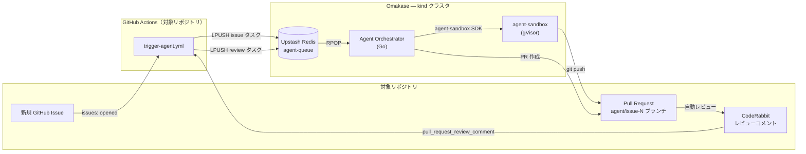
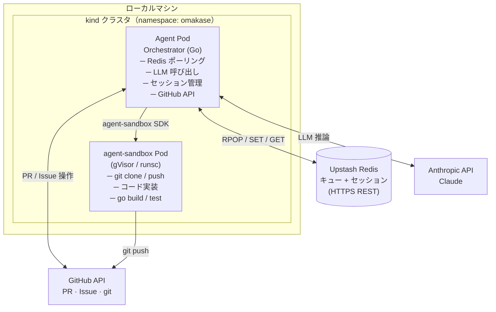
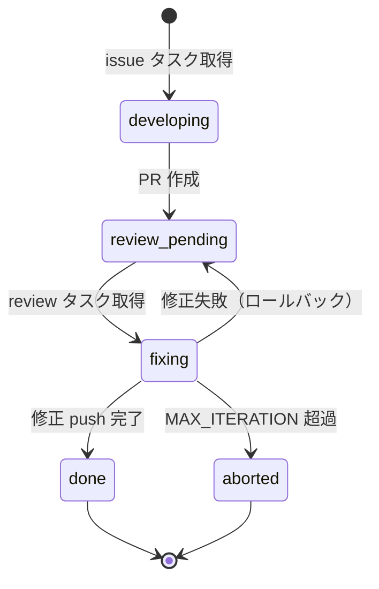

# Omakase

> GitHub Issue を起点に Pull Request を自動生成する自律エージェント — LLM によるコード実装、CodeRabbit のフィードバック対応、反復修正まで、インバウンド通信不要で完結します。

[English README](./README.md) · [セットアップガイド → HOW_TO_USE.ja.md](./HOW_TO_USE.ja.md)

## 概要

Omakase は対象リポジトリの GitHub Issue を監視します。新しい Issue が作成されると、次の処理を自動で行います。

1. Anthropic API (Claude) を使って実装計画と Go コードを生成。
2. gVisor で隔離された Kubernetes サンドボックス内で `go build` と `go test` を実行。
3. feature ブランチを push して Pull Request を作成。
4. CodeRabbit のレビューコメントを受け取り、PR がクリーンになるか反復上限に達するまで修正を繰り返す。

エージェントはローカルの [kind](https://kind.sigs.k8s.io/) クラスタで動作し、アウトバウンド接続のみを行います — インバウンド Webhook サーバーは不要です。[Upstash Redis](https://upstash.com/) がタスクキューとセッションストアを兼用し、*対象リポジトリ*側の GitHub Actions ワークフローが Issue や CodeRabbit コメントを検知して Redis に push します。

## 仕組み



## アーキテクチャ



## 処理フロー

### Phase 1 — Issue → 実装 → PR

1. 対象リポジトリで GitHub Issue が作成される。
2. `trigger-agent.yml` ワークフローが起動し、`issue` タスクを `agent-queue` に LPUSH。
3. Agent Orchestrator がタスクを取得し、Redis にセッションを作成（`status: developing`）。
4. `SandboxTemplate` から `agent-sandbox` Pod を起動。
5. LLM が実装計画と Go コードを生成。
6. サンドボックス内で `git clone` → コード書き込み → `go build` → `go test` → `git push origin agent/issue-N`。
7. GitHub API で PR を作成（タイトル: `feat: implement issue #N`、Closes #N、ベースブランチ: `main`）。
8. セッションを `status: review_pending` に更新。

### Phase 2 — CodeRabbit レビュー → 修正

9. CodeRabbit が PR を自動レビューし、インラインコメントを投稿。
10. `coderabbitai[bot]` のコメントごとに `trigger-agent.yml` が再起動。
11. `review` タスクが `agent-queue` に追加される。
12. Orchestrator がタスクを取得し、iteration カウンタをインクリメントして `fixing` に遷移。
13. 新しいサンドボックス Pod を起動し、修正・テスト・push を実施。
14. セッションが `done` に遷移。`iteration > MAX_ITERATION` の場合は `aborted` に遷移し、Issue にコメントを投稿。

## AgentSession のステート遷移



## コンポーネント

### Agent Orchestrator

システムの中核となる Go アプリケーション。責務：

- `POLL_INTERVAL_SEC` 秒ごとに Upstash Redis をポーリング（デフォルト: 30）。
- Redis 上の `AgentSession` ライフサイクルを管理（`session:{issueNumber}`、TTL: 24 時間）。
- Anthropic API を呼び出して実装計画と修正コードを生成。
- `agent-sandbox` Pod を起動・操作。
- GitHub API で PR を作成し、Issue にコメントを投稿。

### Redis スキーマ

```
# タスクキュー（List）
agent-queue
  LPUSH payload: {"type": "issue"|"review", "issueNumber": 42, "repoOwner": "...", "repoName": "...", "body": "..."}

# セッション（String/JSON、TTL: 24h）
session:{issueNumber}
  {"issueNumber": 42, "status": "developing", "branchName": "agent/issue-42",
   "prNumber": null, "iteration": 0, "generatedFile": "feature.go"}
```

### agent-sandbox

[kubernetes-sigs/agent-sandbox](https://agent-sandbox.sigs.k8s.io/docs/go-client/) が提供する、gVisor で隔離された Kubernetes Pod 上でコードを安全に実行する環境。Orchestrator は次の 3 つの操作を使用します。

| 操作 | 内容 |
| --- | --- |
| `sb.Run(ctx, "command")` | シェルコマンドを実行（`git`、`go test` など） |
| `sb.Write(ctx, "filename", []byte)` | LLM が生成したコードを書き込む（ファイル名のみ、パス不可） |
| `sb.Read(ctx, "filename")` | 既存コードを読み込んで LLM のコンテキストに渡す |

## ディレクトリ構成

```
omakase/
├── .github/
│   └── workflows/
│       ├── trigger-agent.yml   # イベント → Redis ブリッジ（対象リポジトリにコピー）
│       ├── release.yml         # タグ push 時に ghcr.io イメージをビルド・push
│       └── test.yml            # CI テスト
├── agent/
│   ├── main.go                 # エントリーポイント・ポーリングループ
│   ├── orchestrator.go         # AgentSession ライフサイクル管理
│   ├── session.go              # セッション状態（Redis）
│   ├── task.go                 # タスク型定義
│   ├── config.go               # 環境変数の読み込み
│   ├── llm.go                  # Anthropic API クライアント
│   ├── sandbox.go              # agent-sandbox クライアントラッパー
│   ├── github.go               # GitHub API クライアント
│   └── redis.go                # Upstash Redis REST クライアント
├── k8s/
│   ├── environments/
│   │   └── default/            # Tanka 環境（Deployment スペック）
│   ├── sandbox/
│   │   └── template.yaml       # SandboxTemplate: coding-agent-sandbox
│   └── lib/                    # Jsonnet ライブラリ
├── Dockerfile
├── Taskfile.yml                 # クラスタ・デプロイのショートカット（`task` コマンドで実行）
├── kind-config.yaml             # シングルノード kind クラスタ設定
├── feature_list.json            # 受け入れテスト仕様（手動チェックリスト）
├── go.mod
└── go.sum
```

## 技術スタック

| カテゴリ | 技術 | 備考 |
| --- | --- | --- |
| 言語 | Go | Agent Orchestrator 本体 |
| コンテナランタイム | kind | ローカル Kubernetes クラスタ |
| サンドボックス | kubernetes-sigs/agent-sandbox | gVisor による隔離 |
| LLM | Anthropic API (Claude) | コード生成・修正 |
| キュー | Upstash Redis (List) | HTTP REST API、バイナリプロトコル不使用 |
| セッション | Upstash Redis (String/JSON) | キューと同一インスタンス |
| VCS 操作 | sandbox 内 git | clone、commit、push |
| GitHub 連携 | go-github | PR 作成・Issue コメント |
| コードレビュー | CodeRabbit | GitHub App として対象リポジトリにインストール |
| デプロイ | Tanka (jsonnet) | `tk apply environments/default` |

## 外部サービス

| サービス | 用途 | 無料枠 |
| --- | --- | --- |
| [Upstash Redis](https://upstash.com/) | タスクキュー + セッションストア | 10,000 cmd/day、256 MB |
| [Anthropic API](https://www.anthropic.com/) | LLM（コード生成・修正） | 従量課金 |
| GitHub | Issue / PR / Actions / git | パブリックリポジトリは無料 |
| [CodeRabbit](https://coderabbit.ai/) | PR 自動レビュー | OSS は無料 |

> デフォルトの 30 秒ポーリング間隔では 1 日あたり約 2,880 回の RPOP — Upstash 無料枠の範囲に収まります。

## 設定項目

すべての設定は環境変数で行い、`omakase` という名前の Kubernetes Secret 経由でエージェント Pod に渡します。

### 必須

| 変数名 | 説明 |
| --- | --- |
| `ANTHROPIC_API_KEY` | Anthropic API キー |
| `UPSTASH_REDIS_URL` | Upstash REST エンドポイント（`https://xxx.upstash.io`） |
| `UPSTASH_REDIS_TOKEN` | Upstash REST ベアラートークン |
| `GITHUB_TOKEN` | GitHub PAT（Contents + PR + Issues 読み書き権限） |
| `SANDBOX_TEMPLATE` | `SandboxTemplate` k8s リソース名（デフォルト構成: `coding-agent-sandbox`） |

### 任意

| 変数名 | デフォルト | 説明 |
| --- | --- | --- |
| `SANDBOX_NAMESPACE` | `default` | サンドボックス Pod を起動する namespace |
| `POLL_INTERVAL_SEC` | `30` | Redis ポーリング間隔（秒） |
| `MAX_ITERATION` | `5` | CodeRabbit フィードバックの最大修正回数 |

## はじめる

エンドツーエンドのセットアップ手順（前提条件、ローカルクラスタのデプロイ、GitHub 側の設定）は [HOW_TO_USE.ja.md](./HOW_TO_USE.ja.md) を参照してください。

## ライセンス

[Apache 2.0](./LICENSE)
