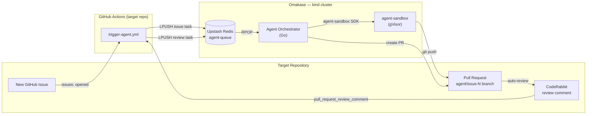
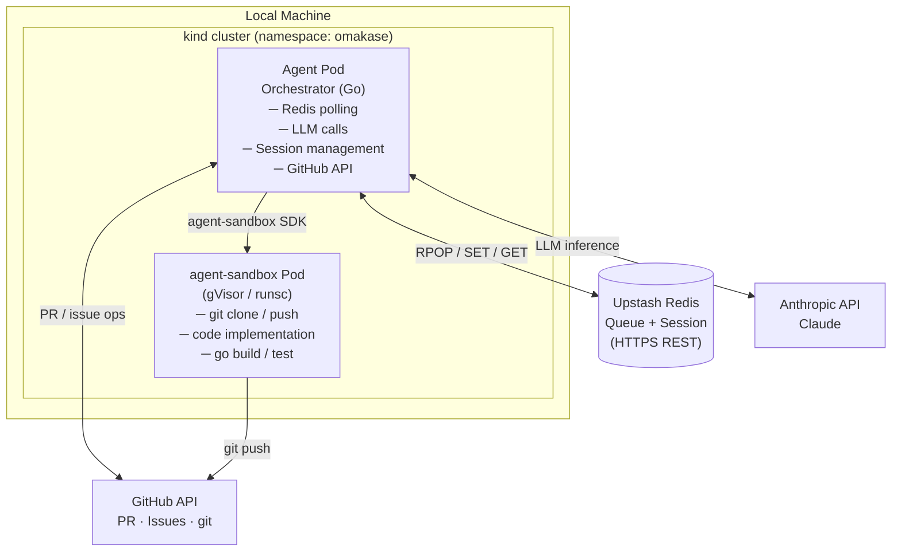
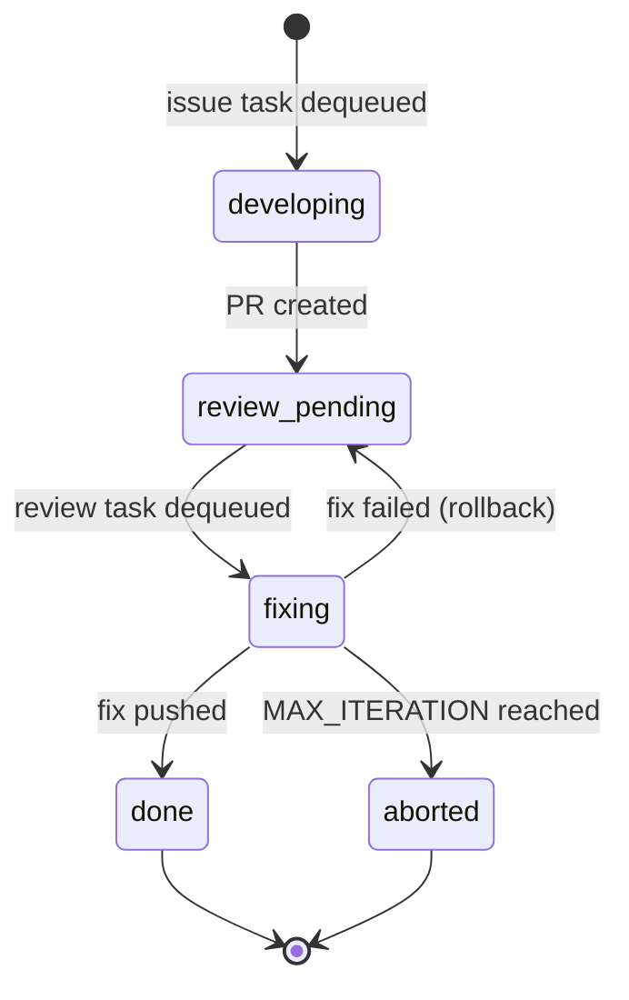

# Omakase

> An autonomous agent that turns GitHub Issues into reviewed pull requests — LLM-driven implementation, CodeRabbit feedback handling, and iterative fixes — with no inbound network endpoint required.

[日本語版 README](./README.ja.md) · [Full setup guide → HOW_TO_USE.md](./HOW_TO_USE.md)

## Overview

Omakase watches a GitHub repository for new Issues. When one is opened, it:

1. Uses a Claude LLM (via the Anthropic API) to generate an implementation plan and Go code.
2. Runs `go build` and `go test` inside a gVisor-isolated Kubernetes sandbox.
3. Pushes a feature branch and opens a pull request.
4. Listens for CodeRabbit review comments and pushes iterative fixes until the PR is clean or the iteration limit is reached.

The agent runs in a local [kind](https://kind.sigs.k8s.io/) cluster and only makes outbound connections — no inbound webhook server is required. [Upstash Redis](https://upstash.com/) serves as the task queue and session store; a GitHub Actions workflow in the *target* repository pushes events to Redis whenever an issue or CodeRabbit comment appears.

## How it works



## Architecture



## Processing flow

### Phase 1 — Issue → Implementation → PR

1. A GitHub Issue is opened on the target repository.
2. The `trigger-agent.yml` Actions workflow runs and pushes an `issue` task to `agent-queue`.
3. The Agent Orchestrator pops the task and creates a Redis session (`status: developing`).
4. An `agent-sandbox` pod is launched from the `SandboxTemplate`.
5. The LLM generates an implementation plan and Go code.
6. Inside the sandbox: `git clone` → write code → `go build` → `go test` → `git push origin agent/issue-N`.
7. A pull request is opened via the GitHub API (title: `feat: implement issue #N`, closes the issue, base: `main`).
8. Session is updated to `status: review_pending`.

### Phase 2 — CodeRabbit review → Fix

9. CodeRabbit automatically reviews the PR and posts inline comments.
10. Each comment from `coderabbitai[bot]` triggers the `trigger-agent.yml` workflow again.
11. A `review` task is pushed to `agent-queue`.
12. The Orchestrator dequeues it, increments the iteration counter, and transitions the session to `fixing`.
13. A new sandbox pod is launched; the fix is applied, tested, and pushed.
14. Session transitions to `done`. If `iteration > MAX_ITERATION`, the session is set to `aborted` and a comment is posted on the issue.

## AgentSession lifecycle



## Components

### Agent Orchestrator

The core Go application. Responsibilities:

- Polls Upstash Redis every `POLL_INTERVAL_SEC` seconds (default: 30).
- Manages `AgentSession` lifecycles stored in Redis (`session:{issueNumber}`, TTL: 24 h).
- Calls the Anthropic API to generate implementation plans and code fixes.
- Launches and communicates with `agent-sandbox` pods.
- Creates pull requests and posts issue comments via the GitHub API.

### Redis schema

```
# Task queue (List)
agent-queue
  LPUSH payload: {"type": "issue"|"review", "issueNumber": 42, "repoOwner": "...", "repoName": "...", "body": "..."}

# Session (String/JSON, TTL: 24 h)
session:{issueNumber}
  {"issueNumber": 42, "status": "developing", "branchName": "agent/issue-42",
   "prNumber": null, "iteration": 0, "generatedFile": "feature.go"}
```

### agent-sandbox

[kubernetes-sigs/agent-sandbox](https://agent-sandbox.sigs.k8s.io/docs/go-client/) provides a gVisor-isolated Kubernetes pod where code is executed safely. The Orchestrator uses three primary operations:

| Operation | Purpose |
| --- | --- |
| `sb.Run(ctx, "command")` | Run shell commands (`git`, `go test`, etc.) |
| `sb.Write(ctx, "filename", []byte)` | Write LLM-generated code (filename only, no path) |
| `sb.Read(ctx, "filename")` | Read existing code for LLM context |

## Repository layout

```
omakase/
├── .github/
│   └── workflows/
│       ├── trigger-agent.yml   # Event → Redis bridge (copy to target repo)
│       ├── release.yml         # Builds and pushes ghcr.io image on tags
│       └── test.yml            # CI tests
├── agent/
│   ├── main.go                 # Entry point, polling loop
│   ├── orchestrator.go         # AgentSession lifecycle
│   ├── session.go              # Session state (Redis)
│   ├── task.go                 # Task types
│   ├── config.go               # Environment variable loading
│   ├── llm.go                  # Anthropic API client
│   ├── sandbox.go              # agent-sandbox client wrapper
│   ├── github.go               # GitHub API client
│   └── redis.go                # Upstash Redis REST client
├── k8s/
│   ├── environments/
│   │   └── default/            # Tanka environment (Deployment spec)
│   ├── sandbox/
│   │   └── template.yaml       # SandboxTemplate: coding-agent-sandbox
│   └── lib/                    # Jsonnet libraries
├── Dockerfile
├── Taskfile.yml                 # Cluster and deploy shortcuts (use `task`)
├── kind-config.yaml             # Single-node kind cluster config
├── feature_list.json            # Acceptance test spec (manual checklist)
├── go.mod
└── go.sum
```

## Tech stack

| Category | Technology | Notes |
| --- | --- | --- |
| Language | Go | Agent Orchestrator |
| Container runtime | kind | Local Kubernetes cluster |
| Sandbox | kubernetes-sigs/agent-sandbox | gVisor isolation |
| LLM | Anthropic API (Claude) | Code generation and fixes |
| Queue | Upstash Redis (List) | HTTP REST API, no binary protocol |
| Session | Upstash Redis (String/JSON) | Shared instance with queue |
| VCS ops | git inside sandbox | clone, commit, push |
| GitHub integration | go-github | PR creation, issue comments |
| Code review | CodeRabbit | GitHub App installed on target repo |
| Deployment | Tanka (jsonnet) | `tk apply environments/default` |

## External services

| Service | Purpose | Free tier |
| --- | --- | --- |
| [Upstash Redis](https://upstash.com/) | Task queue + session store | 10,000 cmds/day, 256 MB |
| [Anthropic API](https://www.anthropic.com/) | LLM (code generation, fixes) | Pay-per-use |
| GitHub | Issues, PRs, Actions, git | Free for public repos |
| [CodeRabbit](https://coderabbit.ai/) | Automated PR review | Free for OSS |

> At the default 30-second polling interval the agent issues roughly 2,880 RPOP commands per day — well within the Upstash free tier.

## Configuration

All configuration is via environment variables, provided to the agent pod through a Kubernetes Secret named `omakase`.

### Required

| Variable | Description |
| --- | --- |
| `ANTHROPIC_API_KEY` | Anthropic API key |
| `UPSTASH_REDIS_URL` | Upstash REST endpoint (`https://xxx.upstash.io`) |
| `UPSTASH_REDIS_TOKEN` | Upstash REST bearer token |
| `GITHUB_TOKEN` | GitHub PAT (Contents + PR + Issues read/write) |
| `SANDBOX_TEMPLATE` | Name of the `SandboxTemplate` k8s resource (default setup: `coding-agent-sandbox`) |

### Optional

| Variable | Default | Description |
| --- | --- | --- |
| `SANDBOX_NAMESPACE` | `default` | Namespace to launch sandbox pods in |
| `POLL_INTERVAL_SEC` | `30` | Redis polling interval in seconds |
| `MAX_ITERATION` | `5` | Maximum CodeRabbit fix iterations before aborting |

## Getting started

See [HOW_TO_USE.md](./HOW_TO_USE.md) for the complete end-to-end setup guide, covering prerequisites, local cluster deployment, and GitHub-side configuration (Actions workflow, repository secrets, CodeRabbit installation).

## License

[Apache 2.0](./LICENSE)
